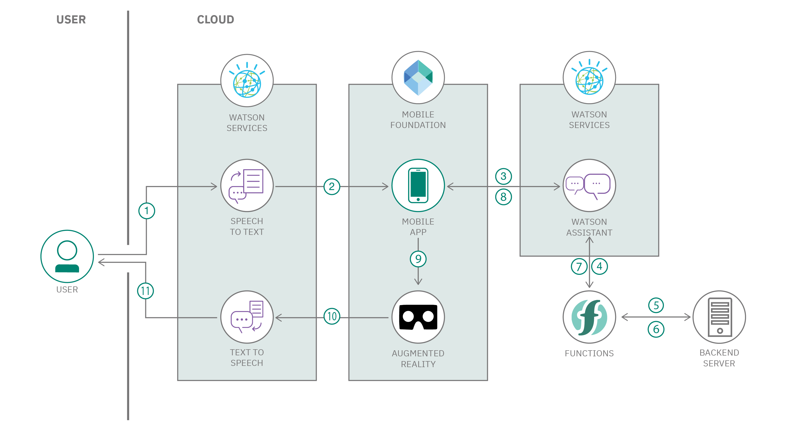
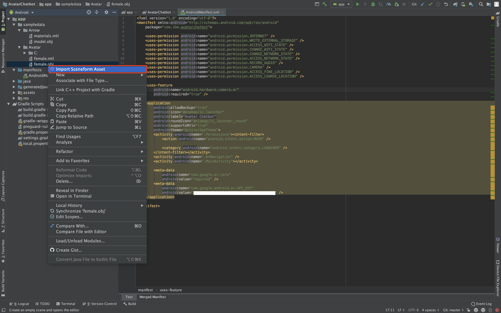

# Avatar based dynamic chatbot powered with AI and AR capabilities

State of the art chatbots need an upgrade, and the good news is they’re getting one. Technologies like artificial intelligence (AI), augmented reality (AR), virtual reality (VR) and more robust network connectivity are opening up a new dimension for  today’s traditional robotic, web-based chatbots. Chatbots integrated with these technologies have the ability to advance businesses bottom line with the help of human connection.

AR and chatbots are perhaps two of the most promising avenues in the current digital world. Both solutions have their range of applicability which could help businesses get more profitable and the customers satisfied. Since customers today are used to communicating with chatbots about their inquiries while at a store or website, adding augmented reality would take it a notch higher. When these two technologies are combined, they create a range of possibilities that have not been utilized before.

This Code Pattern is a demonstration of Avatar based Chatbot, an android mobile Chatbot Application with AI and AR capabilities which dynamically fetches the information using APIs in Watson Assistant via Webhooks(Cloud Functions).

When the reader has completed this Code Pattern, they will understand how to:

* Create and use Avatar using a Mobile Application.
* Integrate Watson Assistant and Python Flask application using Webhooks. 
* Customize based on the personal requirements.
* Create a dynamic real time chatbot.

<!--add an image in this path-->


<!--Optionally, add flow steps based on the architecture diagram-->
## Flow


1. User asks a query to the AR Avatar (mobile app).
2. Mobile application converts the speech to text using Watson speech to text and sends the query to IBM Mobile Foundation.
3. IBM Mobile Foundation securely passes the query to Watson Assistant.
4. Watson Assistant triggers the appropriate IBM Cloud Function, based on the query received.
5. Based on the query, IBM Cloud Function triggers the appropriate service or services, in the backend server application.
6. Backend server application returns the response for the query.
7. IBM Cloud Function sends the response to Watson Assistant.
8. Watson Assistant frames a response to reply to the user and sends it to IBM Mobile Foundation.
9. IBM Mobile Foundation securely sends the response to the mobile application.
10. Mobile application converts the text into speech using Watson Text to Speech.
11. Mobile application replies to the user using the AR Avatar.


<!--Optionally, update this section when the video is created-->
# Watch the Video
[](https://youtu.be/NOX_uWVymco)

## Pre-requisites
* [IBM Cloud account](https://www.ibm.com/cloud/): Create an IBM Cloud account.
* [Python 3](https://www.python.org/downloads/): Install python 3.
* [Java 1.8.x](https://adoptopenjdk.net/?variant=openjdk8&jvmVariant=openj9): Make sure you have required version (Java 1.8.x).
* Before you begin please note that this application uses AR-Core Library, and not all Android devices support AR-Core. To know which devices support AR-Core visit the [Supported Devices](https://developers.google.com/ar/discover/supported-devices) page.
* [Android Studio](https://developer.android.com/studio) : Download and Install Android Studio with SDK Version 26 or Above.


# Steps

Please follow the below to setup and run this code pattern.

1. [Clone the repo](#1-clone-the-repo)
2. [Create Watson services with IBM Cloud](#2-create-watson-services-with-ibm-cloud)
3. [Update the details in the Backend Flask Application](#3-update-the-details-in-the-backend-flask-application)
4. [Deploy the Flask Application](#4-deploy-the-flask-application)
5. [Setup Cloud Functions](#5-setup-cloud-functions)
6. [Setup Watson Assistant](#6-setup-watson-assistant)
7. [Setup IBM Mobile Foundation Server and CLI](#7-setup-ibm-mobile-foundation-server-and-cli)
8. [Setup Google Cloud Anchors](#8-setup-google-cloud-anchors)
9. [Configure Android App](#9-configure-android-app)
10. [Build and Run Android App](#10-build-and-run-android-app)

### 1. Clone the repo

Clone this [git repo](https://github.com/IBM/avatar-based-dynamic-chatbot-with-ai-and-ar-capabilities.git).
Else, in a terminal, run:

```
$ https://github.com/IBM/avatar-based-dynamic-chatbot-with-ai-and-ar-capabilities.git
```

### 2. Create Watson services with IBM Cloud

Create the following services:

* [**Watson Assistant**](https://cloud.ibm.com/catalog/services/watson-assistant): Create a Watson Assistant instance on your IBM cloud.
* [**IBM Cloud Functions**](https://cloud.ibm.com/functions): Create an IBM Cloud Functions instance on your IBM cloud.
* [**Speech to Text**](https://cloud.ibm.com/catalog/services/speech-to-text): Create a Speech to Text instance on your IBM cloud.
* [**Text to Speech**](https://cloud.ibm.com/catalog/services/text-to-speech): Create a Text to Speech instance on your IBM cloud.
* [**Mobile Foundation**](https://cloud.ibm.com/catalog/services/mobile-foundation): Create a Mobile Foundation instance on Your IBM Cloud.

### 3. Update the details in the Backend Flask Application
* Visit the url [Zomato API](https://developers.zomato.com/api) to generate the Api Key for running the application. 
* hit the green colored button `Generate API KEY `.
* Fill the information form. And you will get the `API KEY`. Copy it to Clipboard.
* Open the [Python Flask File](https://github.ibm.com/raravi86/Avatar/blob/master/flask-api/app.py), go to line number 35 of     the code in the function `getRestaurants(coordinates)` and update the user-key which you have generated in the above step.

```bash
header = {"User-agent": "curl/7.43.0", "Accept": "application/json", "user-key": "update the user-key here!"}
```


### 4. Deploy the Flask Application
* Create a [Cloud Foundry](https://cloud.ibm.com/catalog/starters/cloud-foundry?runtime=python) service with python runtime and follow the steps.


* You can give any app name, in our case we have given the app name as `my-api`.

* From the cloned repo, goto _`flask-api`_ directory.

```bash
$ cd flask-api/
```

* Make sure you have installed [IBM Cloud CLI](https://cloud.ibm.com/docs/cli?topic=cloud-cli-getting-started&locale=en-US) before you proceed.

* Log in to your IBM Cloud account, and select an API endpoint.
```bash
$ ibmcloud login
```

>NOTE: If you have a federated user ID, instead use the following command to log in with your single sign-on ID.
```bash
$ ibmcloud login --sso
```

* Target a Cloud Foundry org and space:
```bash
$ ibmcloud target --cf
```

* From within the _`flask-api`_ directory push your app to IBM Cloud.
```bash
$ ibmcloud cf push <YOUR_APP_NAME>
```
>Example: As our app name is `my-api` we use the following command.
```bash
$ ibmcloud cf push my-api
```

* You will see output on your terminal as shown, verify the state is _`running`_:

```
Invoking 'cf push'...

Pushing from manifest to org manoj.jahgirdar@in.ibm.com / space dev as manoj.jahgirdar@in.ibm.com...

...

Waiting for app to start...

...

  state     since                  cpu     memory           disk           details
#0   running   2019-09-17T06:22:59Z   19.5%   103.4M of 512M   343.4M of 1G
```

* Once the API is deployed and running you can test the API.

* Goto [IBM Cloud Resources](https://cloud.ibm.com/resources) and select the Deployed API, _`my-api`_ in our case. 


* Inside the _`my-api`_ dashboard, right click on **Visit App URL** and Copy the link address. 
>Example link address: https://my-api-xx-yy.eu-gb.mybluemix.net


**NOTE: This API Link is Important, please save it in any notepad since it will be used in subsequent steps.**

### 5. Setup Cloud Functions

* Create a [Cloud Function Action](https://cloud.ibm.com/functions/create/action).


* You will see a hello world code in the canvas.


* Copy the code given below and replace it in the canvas as shown.


* Replace the **`CloudFoundryURL`** in the code with the URL that you copied to your notepad in [step 3](#3-deploy-the-flask-application). 
>Example: `CloudFoundryURL = "https://my-api-xx-yy.eu-gb.mybluemix.net"`

<pre><code>
/**
  *
  * main() will be run when you invoke this action
  *
  * @param Cloud Functions actions accept a single parameter, which must be a JSON object.
  *
  * @return The output of this action, which must be a JSON object.
  *
  */
let rp = require("request-promise")

function main(params) {
    <b>var CloudFoundryURL = "<ENTER_YOUR_CLOUD_FOUNDRY_URL_HERE>";</b>
    var latitude;
    var longitude;
    
    var nearby;
    
    var place;
    
    if(params.lat && params.lon){
        this.latitude = params.lat;
        this.longitude = params.lon;
        
        return {msg: "Co-ordinates Stored in Cloud Function"}
    }
    
    if(params.process) {
        
        // Get Place Details
        
        options1 = {uri:CloudFoundryURL+"/getlocation?lat="+this.latitude+"&lon="+this.longitude+"",
        json: true};
        
        rp(options1)
        .then(res => {            
            this.place = res
        });
        
        // Get The Nearby Restaurants
        
        options2 = {uri:CloudFoundryURL+"/getrestaurants?lat="+this.latitude+"&lon="+this.longitude+"",
        json: true};
        
        rp(options2)
        .then(res => {
            this.nearby = {nearby: res['nearby'][18]}
        });
        
        return {msg: "Location and Other Details Processed in background"}
    }
    
    if(params.place) {
        return this.nearby
    }
    
    if(params.getlocation) {
        return this.place
    }
    
	return { message: 'Wrong params passed!' };
}

</code></pre>

* Click on **_Endpoints_** on the left panel and select **_Enable as Web Action_** finally click on **_Save_**.


* Finally Copy the Public Link which is displayed. 


>NOTE: The Above URL should end with **.json** if it is not ending with **.json** please append **.json** at the end of the URL.
**NOTE: This URL is Important, please save it in any notepad since it will be used in subsequent steps.**

### 6. Setup Watson Assistant

* Create a [Watson Assistant Service]().


* Once you create a watson assistant service copy the **_API Key_** and **_URL_** into a notepad as it will be used in [step 6](#6-build-and-deploy-mobile-foundation-adapter).


* Click on Launch Watson Assistant after copying the credentials. In the Watson Assistant Dashboard click on **_Skills_** tab as shown.


* Click on **_Create Skill_** as shown.


* Click on **_Dialog Skill_** and click next.


* Click on **_Import Skill_** and choose the json file from `/watson assistant/skill-Avatar-chatbot.json`.


* You will now see the Assistant Dashboard with skills as shown.


* Click on the **_Options_** button in the left panel and under Webhooks Enter the URL that was copied in [step 4](#4-setup-cloud-functions).


* Back to Watson Assistant Dashboard, open options menu from the recently imported skill **_Avatar-chatbot Demo_** and select **_View API Details_** as shown.


* Copy the **_Skill ID_** in a notepad as it will be used in subsequent steps.


### 7. Setup IBM Mobile Foundation Server and CLI

#### 7.1 Setup Ionic and MFP CLI

* Install `Node.js` by downloading the setup from https://nodejs.org/en/ (Node.js 8.x or above)
```
$ node --version
v10.15.0
```

* Install IBM Mobile Foundation Platform CLI
```
$ sudo npm install -g mfpdev-cli
$ mfpdev --version
8.0.0-2018121711
```

**Note**: If you are on Windows, instead of using `sudo`, run the above command without `sudo` in a command prompt opened in administrative mode.

> Note: While installing MFP CLI, if you hit an error saying `npm ERR! package.json npm can't find a package.json file in your current directory.`, then it is most likely due to [MFP CLI not being supported in your npm version](https://stackoverflow.com/questions/46168090/ibm-mobile-first-mfpdev-cli-installation-failure). In such a case, downgrade your npm as below, and then install MFP CLI.
`$ sudo npm install -g npm@3.10.10`

* Install Java SDK 8 from https://adoptopenjdk.net/?variant=openjdk8&jvmVariant=openj9
```
$ java -version
java version "1.8.0_101"
```
> Note: Java version `1.8.x` is required to build the Java Adapters. Do not Download Java version `11.x`. If you already have java version above `1.8.x` then you can follow the guide in `TROUBLESHOOTING.md` to uninstall the java and reinstall `1.8.x`.

* Install Maven:
On Mac, you can use `brew install` for installing Maven as shown below:
```
$ /usr/bin/ruby -e "$(curl -fsSL https://raw.githubusercontent.com/Homebrew/install/master/install)"
$ brew install maven
$ mvn --version
Apache Maven 3.6.0 ...
```
On Windows, you can follow this [Tutorial](https://www.mkyong.com/maven/how-to-install-maven-in-windows/) to install Maven.

#### 7.2 Create Mobile Foundation service and configure MFP CLI
* In the [IBM Cloud Dashboard](https://cloud.ibm.com/),open [Mobile Foundation](https://cloud.ibm.com/catalog/services/mobile-foundation). Click on `Create` as shown below.


* In the Mobile Foundation service overview page that gets shown, click on `Service credentials`. Expand `View credentials` and make a note of the `url`, `user` and `password` as shown below.


>NOTE: The `user`, `password` and `url` is Important as it will be used in subsequent steps.

<b>NOTE: Make Sure the Cloud Foundry App for Mobile Foundation-Server gets at least `768MB` of Memory.(Recommended is 1GB) You can verify it by going to `IBM Cloud Dashboard > Resources > Cloud Foundry Apps > MobileFoundation-Server` as shown below.</b>


> Note: If *Mobile Foundation* service is not available with your current account type, then you can:
> - Upgrade your account, and avail the *Mobile Foundation* service's free Developer plan which allows the use of the service free for up to ten daily client devices for development and testing activities.

* Back on your local machine, configure MFP CLI to work with Mobile Foundation server by running the following command in console.

> Note: For `Enter the fully qualified URL of this server:`, enter the `url` mentioned in credentials followed by `:443` (the default HTTPS port).
```
$ mfpdev server add
```

* Follow the Instructions.
```
? Enter the name of the new server profile: MyServer
? Enter the fully qualified URL of this server: https://mobilefoundation-xxxx-xxxxx.xx-xx.mybluemix.net:443
? Enter the Mobile Foundation Server administrator login ID: admin
? Enter the Mobile Foundation Server administrator password: **********
? Save the administrator password for this server?: Yes
? Enter the context root of the Mobile Foundation administration services: mfpadmin
? Enter the Mobile Foundation Server connection timeout in seconds: 30
? Make this server the default?: Yes
Verifying server configuration...
The following runtimes are currently installed on this server: mfp
Server profile 'MyServer' added successfully.
```
* Next Verify If the Server is added.
```
$ mfpdev server info
Name         URL
---------------------------------------------------------------------------------------
MyServer  https://mobilefoundation-xxxx-xxxxxx.xx-xx.mybluemix.net:443  [Default]
---------------------------------------------------------------------------------------
```
>Note: If this step fails check `TROUBLESHOOTING.md` to fix commonly occuring errors.


#### 7.3 Deploy the MFP Adapter and Test it
##### 7.3.1 Build and Deploy the MFP adapters
* Go to the `Adapter/avatarchatbot` directory.

```
$ cd /AvatarChatbot/Adapter/avatarchatbot
```

* Build the `avatarchatbot` adapter as shown below.
```
$ mfpdev adapter build
Building adapter...
Successfully built adapter
```
* Deploy the adapter as shown bellow.
```
$ mfpdev adapter deploy
Verifying server configuration...
Deploying adapter to runtime mfp on https://mobilefoundation-xxxx-xxxxxx.xx-xx.mybluemix.net:443/mfpadmin...
Successfully deployed adapter
```

> Note: In [Step 7.2], if you specified `No` to `Make this server the default?`, then you need to specify the name of your server profile (`MyServer` in our case) at the end of `mfpdev adapter deploy` command as shown below.
```
$ mfpdev adapter deploy MyServer
```

##### 7.3.2 Launch MFP dashboard and update adapter configurations
Launch MFP Dashboard as below:
  * In the [IBM Cloud dashboard](https://cloud.ibm.com/dashboard/), under `Cloud Foundry Services`, click on the `Mobile Foundation` service you created in [Step 7.2]. The service overview page that gets shown, will have the MFP dashboard embedded within it. You can also open the MFP dashboard in a separate browser tab by appending `/mfpconsole` to the *url* `https://mobilefoundation-xxxx-xxxxx.xx-xx.mybluemix.net`.
>Example: `https://mobilefoundation-xxxx-xxxxx.xx-xx.mybluemix.net/mfpconsole`

> NOTE: `username` & `password` can be found in `Service credentials` in step 7.2.

  * Inside the MFP dashboard, in the list on the left, you will see the `avatarchatbot` adapter listed.

Update MFP Adapter configuration as below:
  * Inside the MFP dashboard, click on the `avatarchatbot` adapter. Under `Configurations` tab, you should see the various properties as shown.


  * Save the changes by clicking `Save`.

  * Click on `Resources` tab. You should see the various REST APIs exposed by `avatarchatbot` adapter as shown below.


##### 7.3.3 Test the CloudantJava adapter
To Test the adapter use any REST Clients like [Postman](https://www.getpostman.com/downloads/).
After Installing postman type the `url` created in [step 3.2] and append it with `/mfp/api/adapters/avatarchatbot/resource/mfpapi`.

>Example: `https://mobilefoundation-xxxx-xxxxxx.xx-xx.mybluemix.net/mfp/api/adapters/avatarchatbot/resource/mfpapi`.

 * Now click on `Send` button to run the GET `/mfp/api/adapters/avatarchatbot/resource/mfpapi` API. The API response should get shown in the `Response Body` as shown in snapshot below.

 * The GET API on `/mfp/api/adapters/avatarchatbot/resource/mfpapi` should return a JSON object containing `s2tapi`, `s2turl`, `t2sapi`, `t2surl`, `assistantapi`, `assistanturl`, `assistantworkspaceid` & `cloudfuncurl` from your Cloudant as shown below.


### 8. Setup Google Cloud Anchors
* Create a [Google Cloud Account](https://cloud.google.com/).

* In the Google Cloud Dashboard click on **Go To Console**. 


* Create a new Project in Google Cloud Platform.

* Once you create a project in the Dashboard search for **_ARCore Cloud Anchor API_**.


* Click on **Enable**.


* Now in the left panel click on **Credentials**.


* Click on **Create Credentials**. 


* Click on **Help me choose**.


* Select the **api key** option in the top as shwon.


* Finally click on **Create** to create the api key.


**NOTE:Copy the API key as it will be required in the subsequent step.** 

### 9. Configure Android App

* There are 3 more things to be done before running the APP.

#### 9.1. Add the ARCore Cloud API Key in Android Studio

* Open Android Studio and click on **_Open an existing Android Studio Project_** and locate the **AvatarChatbot** directory from the cloned directory.

* In Android Studio open the **AndroidManifest.xml** file in app -> manifests -> AndroidManifest.xml and enter your ARCore Cloud API Key which was copied in step 8.


#### 9.2. Setup Poly Objects in Android Studio

* In Android Studio goto `File > Preferences > Plugins` and click on *Browse Repositories* button.

* Search for the keyword **sceneform** and install it as shown.


* Click on **`Build > Make Project`** to build the android project.

>NOTE: The Initial Gradle Build may take much longer time please be patient.

* Download the poly objects from the bellow URL's.

| Asset | Credits | Link |
| -------------  | ------------- | ------------- |
| Female Human Avatar | Dominic Barnard | https://poly.google.com/view/5sDdEAo2zfq |
| Arrow | Vanessa Cao | https://poly.google.com/view/bC3FokNqTpi |

* Extract the **`.zip`** files.

* In Android Studio, in the left panel right click and select `New > Sample Data Directory` as shown.


* Right click on the newly created `sampledata` directory and select `Reveal in Finder` for Mac.
>On Windows Right click on the newly created `sampledata` directory and select `Show in Explorer`.


* Create two directories named **Avatar** and **Arrow** and extract the contents from the respective `.zips` into the directories.


* Back to Android Studio, go to `sampledata > Avatar` and right click on `female.obj` file and select `Import Sceneform Asset` as shown.



* You will get an Import Wizard, Click on `Finish`.


* Repeat the same for **Arrow**, go to `sampledata > Arrow` and right click on `model.obj` file and select `Import Sceneform Asset`.

* Once you Import both the Assets, you can verify them under `Assets` directory as shown.

 


You are done Importing the Sceneform Assets at this point. 


#### 9.3. Register the Android App to Mobile Foundation Server

* On the Commandline, enter the following command to register the app to Mobile Foundation server.
```
$ mfpdev app register
Verifying server configuration...
Registering to server:'https://mobilefoundation-xxxx-xxxxx.xx-xx.mybluemix.net:443' runtime:'mfp'
Registered app for platform: android
```

### 10. Build and Run Android App

* Install Android SDK Platform 24 (or higher) as below:
  - Launch Android Studio.
  - Click on `Configure` -> `SDK Manager`.
  - Under `SDK Platforms`, select `Android 7.0 (Nougat) API Level 24` or higher. Click `Apply` and then click `OK`. This will install Android SDK Platform on your machine.

* Enable USB debugging on your Android phone as per the steps in https://developer.android.com/studio/debug/dev-options
  - Launch the Settings app on your phone. Select `About Device` -> `Software Info`. Tap `Build number` 7 times to enable developer options.
  - Return to Settings list. Select `Developer options` and enable `USB debugging`.
* If you are developing on Windows, then you need to install the appropriate USB driver as per instructions in https://developer.android.com/studio/run/oem-usb.
* Connect the Android phone to your development machine by USB cable, you will get a prompt displaying adb access required, `allow` the access.

> Note: If you have android [adb tools](https://developer.android.com/studio/command-line/adb) you can check whether your device is connected or not by entering `adb devices`.

* Connect the android device to the deployment machine it will be displayed on the screen. Select that and click `ok`.


> Note: You will get a prompt displaying adb access required, `allow` the access only then the device will be shown in the above window.

* Wait for Gradle to finish the build and install the Apk on your android device.

# Sample output

**NOTE: Please follow the tutorial in the app to train the path before folowing this flow.**

 

### The workflow of the app is as follows.

**NOTE: The user has to follow the exact same workflow for the app to function as intended.**

- The user summons the Avatar Chatbot by taping on the Anchors in the app.

 

1. The Avatar Chatbot tells user their location.

> Bot: Looks like you are in <b>\<YOUR-LOCATION>?</b>

2. The user has to reply with yes to confirm.

> Yes

3. The Avatar Chatbot can then read the user's Interest based on their activities on the phone. 

> I got to know that you are a massive <b>Nike fan</b>, Do you want me to guide you to a <b>nearby Nike store</b> that has got new collections?

**NOTE: This feature is just to showcase the capabilities of watson services and is not currently implemented in the code pattern. You can modify as per your requirements.**

4. Asuming user wants to do something else user has to reply with no thanks.

> No thanks

5. The Avatar Chatbot will ask the following.

> Okay, do you want me to help with anything else?

6. Asuming user is looking for restaurants the user has to say the following.

> I am looking for a good restaurant near me

**NOTE: In this code pattern we have just inplemented Food API to get food related queries, you can have any service APIs to increase the functionality of the chatbot.**

7. The Avatar Chatbot finds out the best restaurant nearby.

> <b>\<Restaurant-Name></b> has the best rating around this place. Do you want me to guide you to <b>\<Restaurant-Name></b>?

8. Asuming the user is satisfied with the result, the user confirms by saying cool works.

> cool works!

7. The Avatar Chatbot says the following.

> Please follow the path.

- The User will then click on **SHOW ROUTE** button and the Augmented path will appear guiding you to the destination that you trained earlier.

 


**NOTE: This code pattern acts as a foundation for building intelligent AR based chatbots. You can modify this code pattern and build as per your requirement.**

## Related Content

* [Build a ‘try-and-buy’ mobile application with augmented reality capabilities for a furniture store](https://developer.ibm.com/patterns/augmented-reality-android-mobile-app-interior-decorator/)

* [Integrate a virtual mirror with e-commerce products](https://developer.ibm.com/patterns/integrate-a-virtual-mirror-with-e-commerce-products/)

* [A Watson Visual Recognition recommendation example](https://developer.ibm.com/blogs/a-watson-visual-recognition-recommendation-example/)

<!-- keep this -->
## License

[Apache 2.0](LICENSE)
